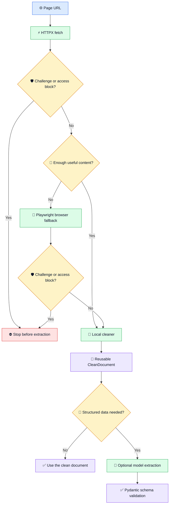

# AGInaz Smart Miner Engine ⚡

**Turn messy web pages into reusable, structured documents for research workflows.**


> [!NOTE]
> **This is the public portfolio view.** The full engine is developed privately.
> This repository contains a small, testable routing excerpt from v1.2 and a
> recorded example using synthetic data. It is not a downloadable engine build.

## 🤔 Why Smart Miner?

Web pages do not all need the same extraction method. Plain HTML can be fetched
quickly over HTTP, while JavaScript-heavy pages may need a browser. Smart Miner
checks the visible content before deciding whether to render the page. It then
keeps useful structure—headings, tables, links, source URL and valid JSON-LD—in
a document that can be reused for later extraction.

## 🔎 Explore the project

| See it in action | Open |
| --- | --- |
| 📄 A messy page turned into structured input | [Before/after example](examples/sample-output.md) |
| 🖥️ A visual walkthrough | [Static HTML demo](demo/index.html) |
| 🧩 A small implementation excerpt | [Content-quality signal](examples/content_quality.py) and [its tests](tests/test_content_quality.py) |

The HTML demo shows recorded output. It does not fetch a website or call an LLM.

## 🏗️ How the engine works



- ⚡ **Browser only when needed:** the fallback has a bounded wait for dynamic
  content and runs only when the static-content checks call for it.
- 🧹 **Structure over noise:** cleaning retains headings, tables, resolved links
  and valid JSON-LD. Identical navigation blocks can be deduplicated; repeated
  data rows remain.
- 🛡️ **Stop at barriers:** challenge/CAPTCHA detection is heuristic and does
  not solve CAPTCHA or recover access.
- ✅ **Validate the shape:** Pydantic checks output structure and types, not
  whether the extracted claims are true.

The v1.2 `route()` response keeps `success`, `text`, `error` and `routing`
metadata. The newer local pipeline adds a reusable document and an explicit
status for blocked pages.

## 🧪 Evidence, with limits

The local prototype passed **19 offline tests** and **one opt-in browser test**
using a delayed AJAX page served from a loopback server. The public routing
excerpt has [four independent tests](tests/test_content_quality.py):

```bash
python -m unittest discover -v
```

In one synthetic fixture, raw HTML measured **473 characters** and the complete
clean extraction input measured **309 characters**, including source URL and
title. These are character counts for one example, not a token-cost benchmark
or a claimed saving across websites.

The demonstrated scope is single-page fetching, cleaning, barrier stopping
and optional extraction. It does not include login recovery, CAPTCHA solving,
large-scale crawling or multi-agent orchestration.

## 📦 What is public

This repository contains the README, a static HTML walkthrough, a recorded
synthetic output and a small v1.2 routing-signal excerpt with tests. It has a
fresh Git history, separate from the private engine repository. The fetcher,
cleaner, orchestrator, browser control and LLM provider are **not included**.

A Streamlit version is being reviewed locally. We will inspect and test its UI
before deciding whether to publish it; a live-demo link can be added here then.
This engine portfolio does not need a GitHub Release.

## 🔒 Copyright and use

Copyright © 2026 Hatef-AGInaz. All rights reserved. This public portfolio is
available to view, but it is not open source and does not grant permission to
reuse its code or other contents. See [LICENSE](LICENSE) for details.

**Project:** AGInaz · **Private development target:** v1.3.0
